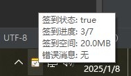
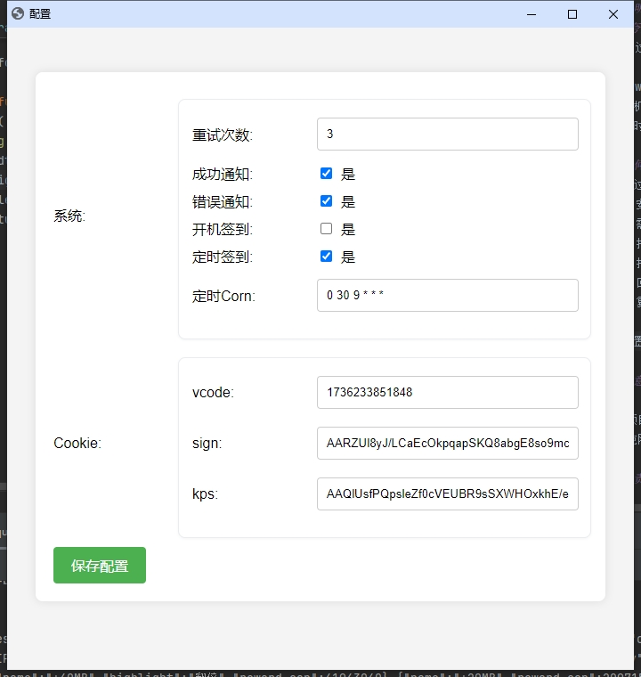

## 说明
### 夸克网盘自动签到
项目通过翻写Python代码实现,参考[`https://github.com/whi3e55/Quark_Auot_Check_In`](https://github.com/whi3e55/Quark_Auot_Check_In)

实现了windows托盘,需要设置开机自启
  - 
1. 开机立马签到
2. 定时签到,使用cron表达式,默认每天早上9点开始签到 `0 0 9 * * *`

## 如何使用
1. 通过手机进行抓包(必须)
   - 安装抓包工具,例如 [`proxypin`](https://github.com/wanghongenpin/proxypin)
   - 需要开启HTTPS代理,下载并安装ca证书到手机
   - 打开抓包工具并运行
   - 打开夸克网盘额签到页面
   - 回到抓包工具,并找到url为 `https://drive-m.quark.cn/1/clouddrive/capacity/growth/info` 的请求信息
   - 复制url后面的参数: `kps` `sign` `vcode`
2. 把 `kps` `sign` `vcode` 填写到 `签到工具` 相应的配置中
   - 
3. 设置 `签到工具` 开机自启即可
   - 
4. 运行结果
   - 

## 注意事项

- 本项目仅用于学习用途，请勿用于非法用途。
- 夸克网盘可能会更新接口或规则，导致签到脚本失效，届时需要重新获取 Cookie 并更新代码。

## 免责声明

本项目为开源学习项目，作者不对项目使用产生的后果负责。使用过程中如有疑问，请参考夸克网盘的官方使用条款。
